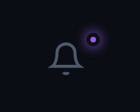
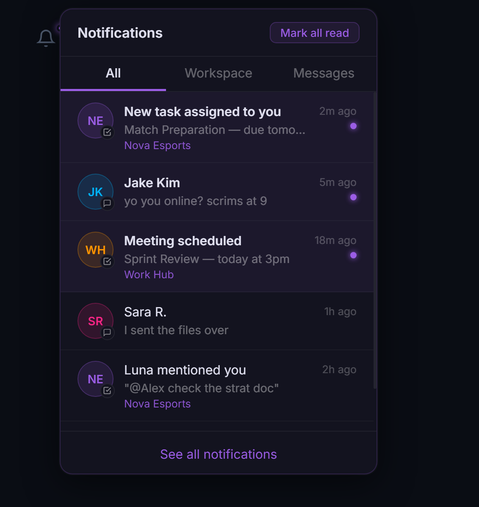

# Notification Bell UI

A dark-themed, interactive notification dropdown component built with pure HTML, CSS, and vanilla JavaScript — no libraries, no frameworks.

How the icon looks like:



How the bar looks like:



---

## 📋 Overview

This project is a **notification bell button** with a dropdown panel — similar to what you'd find in apps like Slack, Notion, or Discord. Clicking the bell opens a styled panel with tabbed filtering, unread badges, and "mark all read" functionality.

---

## 🗂️ File Structure

```
├── index.html       # HTML structure — bell icon, dropdown, tabs, list
├── style.css        # All styling — dark theme, animations, scrollbar
├── main.js          # All logic — rendering, filtering, badge, events
├── Screenshot_2026-05-05_120552.png   # Dropdown open state
└── Screenshot_2026-05-05_120542.png   # Bell with unread badge
```

---

## ✨ Features

- 🔔 **Bell icon** with a glowing purple unread dot badge
- 📋 **Dropdown panel** that opens/closes on click
- 🗂️ **3 tabs** — All, Workspace, Messages — with live filtering
- 🟣 **Unread indicators** — purple dot + bold title + tinted background
- ✅ **Mark all read** button — clears all unread states at once
- 👆 **Click a notification** to mark it as read individually
- 🚪 **Click outside** the dropdown to close it
- 🎞️ **Smooth open animation** using `cubic-bezier`

---

## 🎨 Design Details

### Color Palette
| Variable | Value | Usage |
|----------|-------|-------|
| `--purple` | `#9b5de5` | Accents, badges, active tab |
| `--sidebar-bg` | `#0b0f18` | Sidebar background |
| `--muted` | `#4e5a6e` | Inactive icons |
| `--subtle` | `#7a8799` | Hover states |

### Dropdown
- Background: `#13131f` — slightly lighter than the page
- Border: `1px solid rgba(155,93,229,0.2)` — subtle purple glow
- Border radius: `12px`
- Box shadow: deep multi-layer shadow for depth
- Max height on list: `320px` with custom scrollbar (3px, subtle)

### Notification Items
- Each item has an **avatar circle** with initials, colored per contact
- A small **type icon** (workspace ✓ or chat 💬) overlays the bottom-right of the avatar
- Unread items have a **purple tinted background** and **bold title**
- A **glowing purple dot** appears on the right for unread items

### Animation
```css
@keyframes notifIn {
  from { opacity: 0; transform: translateY(-6px) scale(0.97); }
  to   { opacity: 1; transform: translateY(0) scale(1); }
}
```
The dropdown slides in from slightly above with a subtle scale effect.

---

## ⚙️ How It Works (JavaScript)

### Data
All notifications live in a `NOTIFICATIONS` array of objects:
```js
{ id, type, ws, avatar, color, title, sub, time, unread }
```

### Key Functions
| Function | What it does |
|----------|-------------|
| `renderList()` | Builds the notification HTML based on active tab |
| `getFiltered()` | Returns notifications filtered by `activeTab` |
| `updateBadge()` | Shows/hides the purple dot on the bell icon |
| `init()` | Sets up all event listeners |

### Tab Filtering
Clicking a tab sets `activeTab` to `'all'`, `'workspace'`, or `'chat'`, then calls `renderList()` which filters the array and re-renders.

### Click Outside to Close
```js
document.addEventListener('click', () => dropdown.classList.remove('open'))
dropdown.addEventListener('click', e => e.stopPropagation())
```
Clicking anywhere on the page closes the dropdown — but clicks *inside* the dropdown are stopped from bubbling up so it stays open.

---

## 🛠️ Technologies Used

| Technology | Purpose |
|------------|---------|
| HTML5 | Structure — bell, dropdown, tabs |
| CSS3 | Dark theme, animations, flexbox layout |
| Vanilla JavaScript | Logic — render, filter, badge, events |
| Google Fonts (Inter) | Clean modern typography |
| SVG icons | Bell icon, workspace/chat type indicators |

---

## 🚀 How to Run

1. Place all files in the same folder
2. Open `index.html` in any modern browser
3. No installations or build tools required
